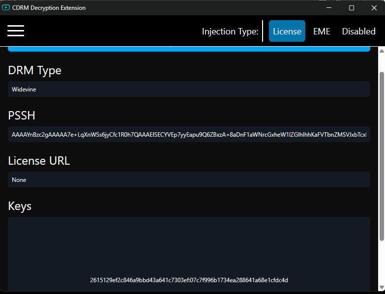

# CDRM-Extension

[]()
[]()
[]()

**CDRM-Extension** is a developer/debugging browser extension for capturing and manipulating DRM license flows (Widevine & PlayReady). It supports license interception, challenge injection, remote CDM session management, and key extraction.

---

## Features

- Intercept and modify DRM-related `XMLHttpRequest` and `fetch()` POST calls.
- Support for Widevine & PlayReady license flows.
- Remote CDM session management:
  - Open/close sessions
  - Generate challenges
  - Parse license responses
  - Extract decryption keys
- Configurable via injected scripts & content–page messaging:
  - DRM override mode
  - Injection type: `EME`, `LICENSE`, or `DISABLED`
  - Remote device info for CDM access
- Works with ArrayBuffer, string, and JSON license payloads.
- Console-logged debug info for transparency.

---

## Installation

1. Clone this repository:
   ```bash
   git clone https://github.com/ex3mpli/CDRM-Extension.git
   Open chrome://extensions/ in your Chromium-based browser.
   
2. Enable Developer mode (toggle top-right corner).

3. Click Load unpacked and select the project folder.

4. The extension will be activated on supported DRM playback pages.

## Screenshot

Here's a preview of the CDRM Extension in action:



## Disclaimer
This project is for educational and research purposes only.
Using it to bypass DRM protections may violate terms of service or local laws.
Use responsibly and at your own risk.

## Credits
Developed and maintained by **[TPD94](https://github.com/TPD94)**.  
Big thanks to the open-source DRM and reverse-engineering community.
